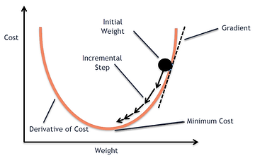
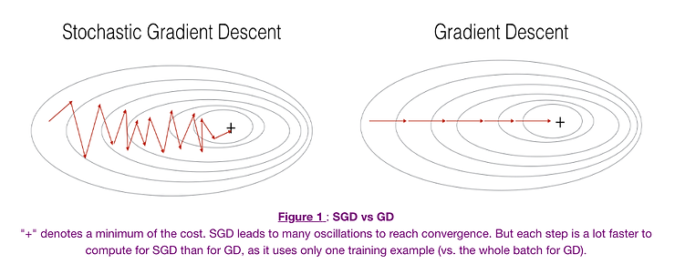

# AI Integrated
## Motivation
I primarily come from a backend development background. When I started learning data science and machine learning on my own, it was challenging to connect the dots since the materials were scattered around like piecemeal. With the advent of ChatGPT, AI became a hot topic, and everyone wanted to get involved. When colleagues, friends, and students approached me for discussions, it was difficult to provide a single point of reference where they could get a complete picture of what we were talking about. That’s when I decided to create an integrated learning space for AI. It’s common for people to be confused with AI, Data Science, ML, DL, and General AI. This space will offer a better understanding of each one of them and how they are related.


## Machine Learning and Deep Learning synopsis 

Those who come from a development background may find it challenging to understand how machines learn autonomously from data. Typically, developers write functions that take a set of input data, perform certain logic, and return the output. However, in Machine Learning, it’s the other way around; the algorithm learns the logic from the data, which it then uses to predict the output. 

```
for i in range(nb_epochs):   
    params_grad = evaluate_gradient(loss_function, data, params)           
    params = params - learning_rate * params_grad
```

The above code snippet illustrates how a machine learns by adjusting the parameters/wieghts in each iteration until the optimal values are reached. This process is known as Gradient Descent. The learning rate determines the speed at which the algorithm converges to the optimal parameter values/weights. It’s crucial to choose an optimal value for the learning rate. If it is too high, there’s a risk of oscillation, preventing convergence. The method used to calculate the error is known as the Loss Function.

 The concept is depicted in the diagram below.   




