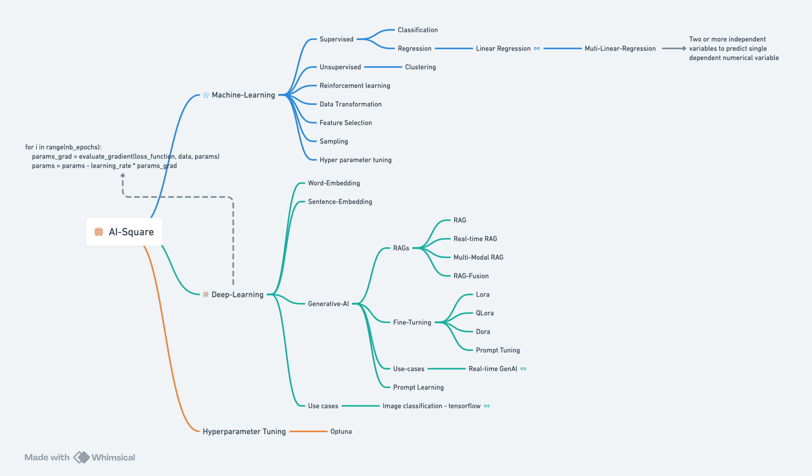

# ai-integrated
## About
I primarily come from a backend development background. When I started learning data science and machine learning on my own, it was challenging to connect the dots since the materials were scattered around like piecemeal. With the advent of ChatGPT, AI became a hot topic, and everyone wanted to get involved. When colleagues, friends, and students approached me for discussions, it was difficult to provide a single point of reference where they could get a complete picture of what we were talking about. That’s when I decided to create an integrated learning space for AI. It’s common for people to be confused with AI, Data Science, ML, DL, and General AI. This space will offer a better understanding of each one of them and how they are related.

## Machine Learning and Deep Learning synopsis 

'''
for i in range(nb_epochs):   
    params_grad = evaluate_gradient(loss_function, data, params)           
    params = params - learning_rate * params_grad
'''

